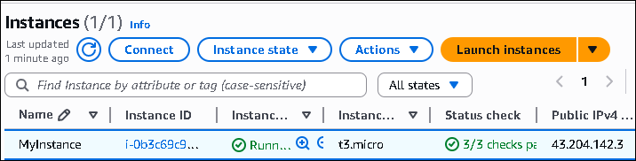
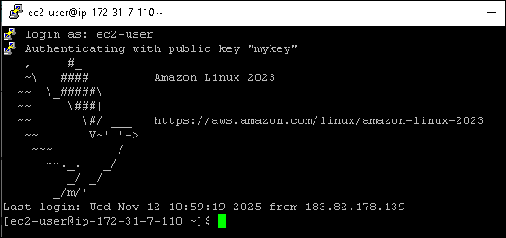

# AWS EC2 Web Server Hosting Project

A simple **web server deployment project** using **Amazon EC2** under the **AWS Free Tier**.  
This project demonstrates launching an EC2 instance, connecting via SSH, installing a web server, and hosting a sample webpage.

---

## Overview
This project explains how to set up and host a simple website on an **Amazon EC2 (Elastic Compute Cloud)** instance.  
It covers creating a Linux instance, configuring security groups, connecting through SSH, and deploying a basic web page using Apache.

---

## Project Highlights
- Created and launched an **EC2 instance** on the AWS Free Tier  
- Configured **security groups** to allow HTTP (port 80) and SSH (port 22) access  
- Connected to the instance using **SSH**  
- Installed and configured **Apache Web Server** on Amazon Linux  
- Deployed a simple web page and accessed it via public IP  

---

## Project Screenshots

| Description | Screenshot |
|--------------|-------------|
| EC2 Dashboard |  |
| Instance Configuration |  |
| SSH Connection Proof |  |
| Web Page Output |  |

---

## Skills & Tools Used
- **Amazon EC2 (Elastic Compute Cloud)**  
- **Amazon Linux 2023**  
- **Apache HTTP Server**  
- **SSH (Secure Shell)**  
- **AWS Free Tier**  

---

## 💚 Author
**Aarthi Arivuselvan**  
AWS Cloud Enthusiast ☁️ | Linux Learner 🐧  
📧 Contact: aarthi11920@gmail.com
